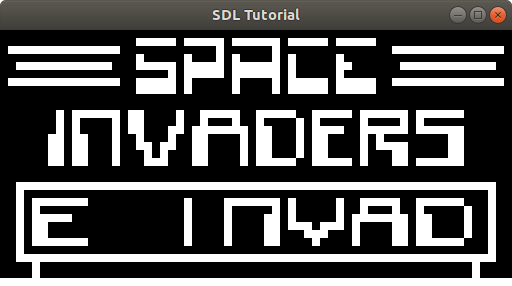
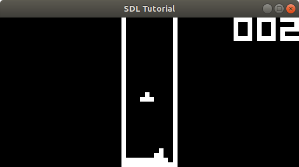

# Potato-8
Yet another Chip-8 emulator

##Screenshots



##Getting Started
This project requires the following:
+ CMake 3.10.2 or newer
+ SDL2
+ C++ compiler of your choice

Testing has been done only on Ubuntu 18.04.

##Building and running
To build simply run
```
cmake .
make
```

To load and run a rom simply run:
```
./potato-8 rom.rom
```
Replace rom.rom with a relative path to your rom file.

##Contributing
Please open a pull request with any contribution you wish to make.

##Acknowledgements
+ Cowgod's CHIP-8 reference http://devernay.free.fr/hacks/chip8/C8TECH10.HTM
+ StackOverflow